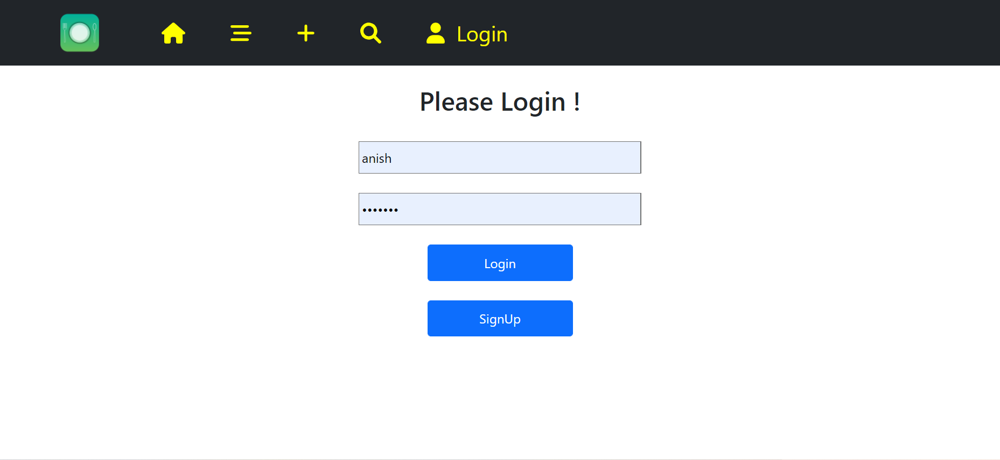

# RESTAURANT RATING APP

## Table of Contents

- [Overview](#overview)
  - [Description](#description)
  - [Objectives](#objectives)
  - [Screenshot](#screenshot)
  - [How to Run](#how-to-run)
  - [Technical Skills](#technical-skills)
  - [Frameworks/Platforms/Libraries](#frameworks/platforms/libraries)
  - [Tools](#tools)
  - [Cloud](#cloud)
  - [Browsers](#browsers)
  - [IDEs/Editors](#ides/editors)
  - [Acknoledgement](#Acknowledgement)
- [Author](#author)
  - [Connect With Me](#connect-with-me)
  - [Github Stats](#github-stats)

## Overview

### Description

The app provide the details of the restaurant such as its address and email and their ratings. A user can login or register its account. A new restaurant's details can be added and existing restaurant's details can be updated. User can see the list of all restaurant's details. The project includes Routing, Fake API , API calls, listing of all restaurant's details, search restaurants, delete restaurants, style and design.

### Objectives

- Make a react project struncture
- Routing and Protected Routing
- Login and Registration
- API calls​
- Listing of restaurant's details
- Add new restaurants
- Update restaurant's details
- Delete restaurants
- Search restaurant's Details
- Style and design

### Screenshot

 Home Page
 

 Create Page
 

Listing Page
 

Login Page
 

Search Page
 

 SignUp Page
 

### How to Run

- Note : Make sure you are in the project folder
- STEP 1 : npm run server
- STEP 2 : npm start

### Technical Skills

 

### Frameworks/Platforms/Libraries

 

### Operating System

 

### Tools

 

### Browsers

 

### IDEs/Editors

 

## Authors

### Connect With Me

 
 

### GitHub Stats

